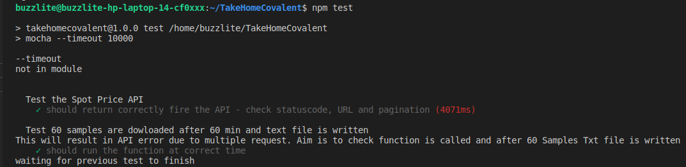
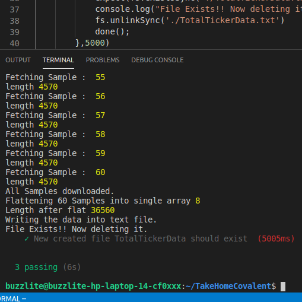

# COVALENT TAKE HOME EXERCISE 
Time Taken --> (4.5 hours)
<!-- 
## Problems Faced
    * Time utilization - The Ticker end point bug had been fixed. Not knowing that, I tried to start with creating a React App. After halfway through building APP it was found that there were no "null" values in "contract address".  -->

## Instructions

* Clone the Repo and cd into the directory.
* Change .env_sample to .env and paste you API_KEY from covalent.
* Open Two Seperate Terminals - Let's Call them Terminal 1 and Terminal 2.
* In terminal 1 execute the following to start fetching of the data and dowloading it into a .txt File. After 60 min a new file will be created with name - "TotalTickerData.txt"

```terminal
    ./script.sh
```

* In Terminal 2 execute to analyze the data on Python. After 60min new .png will be created every 60 min and updated later with the new chart of the data downloaded in the last 60 min. Open it to observe the changes.

```terminal
    ./script2.sh
``` 
* To perform the test, first stop the scripts by "CTRL+C" in both terminals and execute the following command in any terminal.

```terminal
    npm test
```
## Test results

### Test 2



### Test 3



## Problems Faced and Areas of Improvement

## Problem
1) After making the first API call, I started the project with creating REACT App and developing UI to start and stop the timers. The project started with an aim to develope only node.js based application. But halfway into the project it was realized that the bug has been fixed by Covalent. Hence, I chose to use python's numpy library to randonly insert NAN values into contract_addresses. I tried finding "Nulls", None Type, Empty strings, 0 Adrress in the contract_address but none of them were found. Hence, I had to mock the null values randomly in the data.
With only 2 hour remaining in the end, there was no time to integrate UI and back-end. Hence, I adopted to use shell scripts to synchronize both scripts.

2) The following application is not containerized. Hence it will be hard to run it on other computers. Reason behind is that to develope the code, few node.js modules and python libraries were installed.

3) Due to poor time utilization, I had 1hour minutes to build test. Having never tested API before, this was a challenge. To run the test, current code makes actual API calls to COVALENT ticker end point instead of imitating the response. In the third test, because a spy function and a fake timer is used to make multiple calls in a second to imitate actual function,  most of the API Calls return in error. The actual data comping from API calls can be tested correctly from first two tests, third test just tests if the new ".txt" file is written after 60 min for analysis on python.

## Improvement
1) I learned it is very important to completely analyzed data before rushing into developement. Spending enough time in analyzing the data is crucial because, it promotes lean software developement - optimizing time utilization and reducing waste of resource. With a well executable plan, this projet was doable within time frame.

2) Assuming a new project is not made from scatch, the current project can be improved by dockerizing files for easy execution. Since two different languages are used, this reduces complexity.

3) The third test can be improved by replacing spy functions by stub and imitating the response of Covalent API instead of actually calling it for 60 times within a second. The response can be used to create a fake ".txt" file.